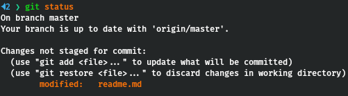
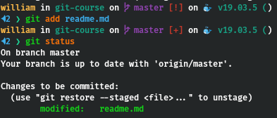

# Course Git

## git trabalha com três estágios

### arquivo que não esta vendo versionado

 ```
  git status
 ```

 

### arquivo sendo adicionado e versionado

```
  git add readme.md
```



#### adiciona todos os arquivos a serem commitados

```
git commit -a -m "message"

```
