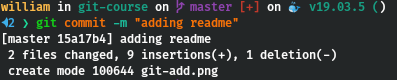
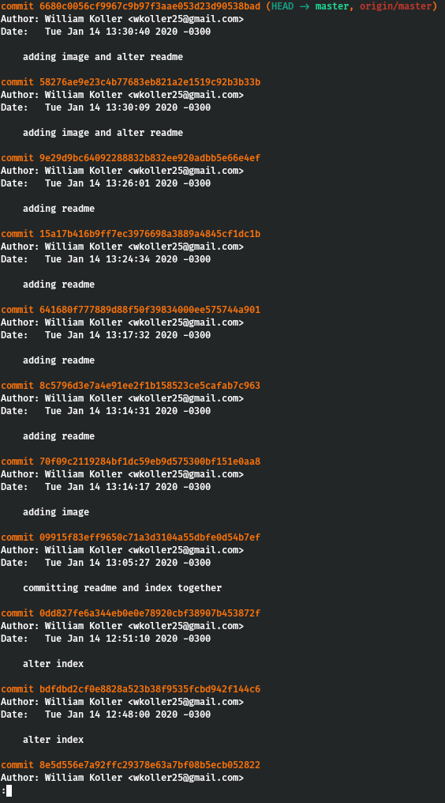

# Course Git

## git trabalha com três estágios

### 1 - arquivo que não esta vendo versionado

 ```
  git status
 ```

  

### 2 - arquivo sendo adicionado e versionado

```
  git add readme.md
```


### 3 - arquivo sendo commitado

```
  git commit -m "adding readme"
```



#### adiciona todos os arquivos a serem commitados

```
git commit -a -m "message"

```

#### mostra os logs

```
  git log
```


